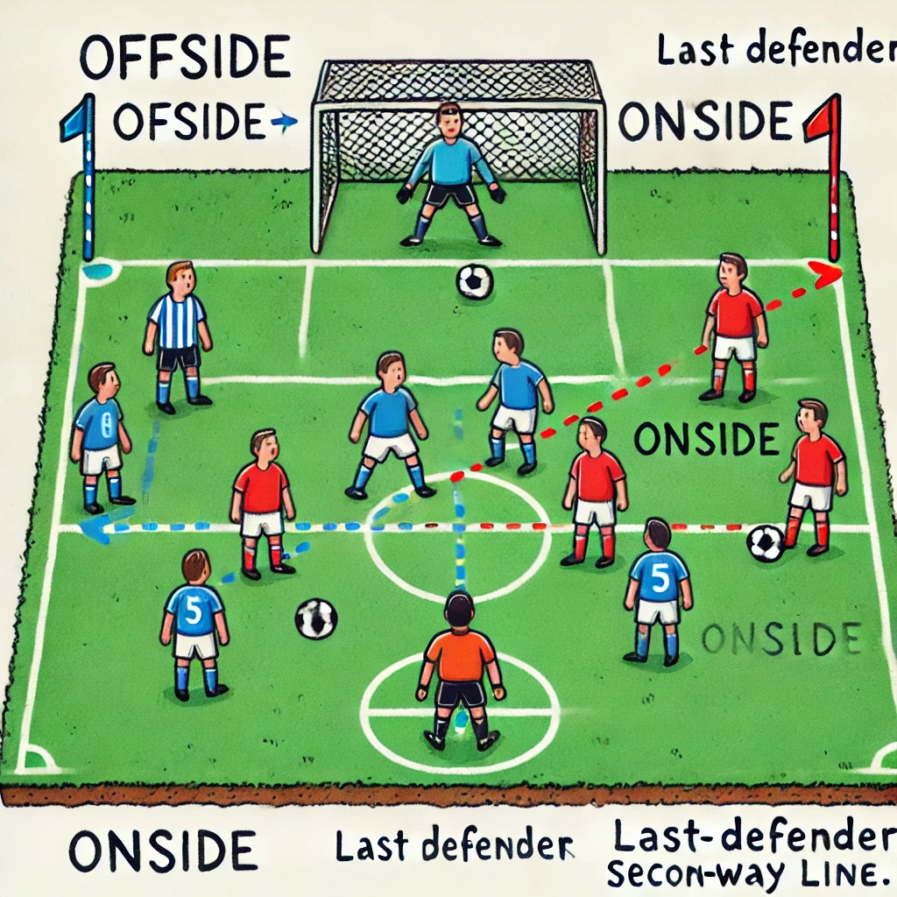

# ⚽ Hva er offside? (For 12-åringer)

<!-- Legg til en bilde link /Users/lewiuberg/repositories/muil-fotball/docs/assets/img/tips/offside-1.png -->

<!--  -->

**Offside** handler om at en spiller ikke kan stå for langt foran forsvarerne når laget prøver å score mål. Det er en regel som gjør spillet mer rettferdig og morsomt.

---

## 🟢 Offside i angrep

En **angrepsspiller** er **offside** hvis disse tre tingene skjer **samtidig**:

1. Spilleren er **nærmere motstanderens mål** enn både **ballen** og **nest siste forsvarer** (ofte keeperen + én forsvarer).
2. Spilleren **er på motstanderens banehalvdel**.
3. Spilleren får **ballen spilt til seg** eller **blander seg inn i spillet**.

👉 **Eksempel**: Du står foran keeperen og forsvareren, og kompisen din passer deg ballen. Da jukser du nesten, for du "lurer deg bak" forsvaret – og **det er offside**.

---

## 🛡️ Offside i forsvar

Som **forsvarsspiller**, prøver du ofte å **få angriperen til å bli offside**. Dette kalles "å sette en offsidefelle".

**Eksempel**:

- Du og laget ditt går litt fram samtidig, slik at angriperen plutselig står **bak dere** akkurat idet en pasning kommer. Da blir det **offside**, og motstanderen mister sjansen.

---

## 🎯 Tenk på dette bildet

Tenk deg en **usynlig linje** som går fra den **nest siste forsvareren** og tvers over banen. Angriperen må **være på riktig side av linja** (altså bak forsvareren) **når pasningen slås**, ellers er det offside.

---

## 🔔 Viktige unntak

Du **kan ikke være offside** hvis:

- Du står på **din egen banehalvdel**.
- Du får ballen fra **et innkast, hjørnespark eller målspark**.
- Du **ikke er involvert** i spillet (f.eks. bare står der og ikke gjør noe).

---

Vil du også ha en tegning som viser dette? Jeg kan lage en enkel visuell forklaring.
